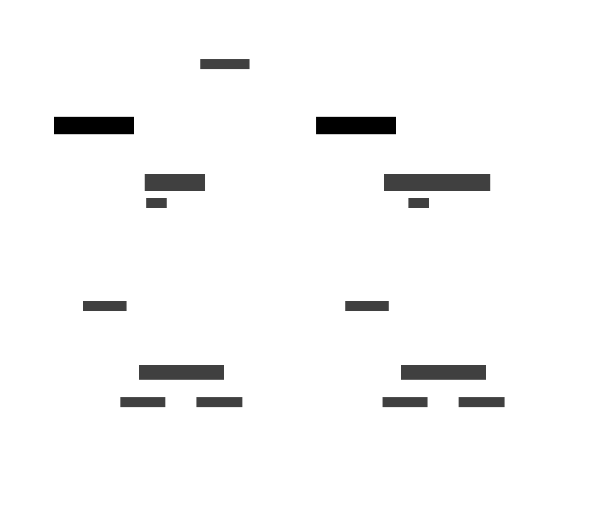
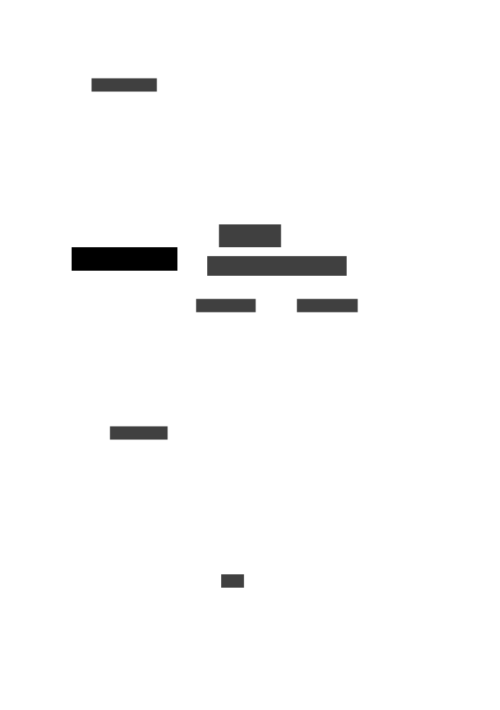

## Architecture

knot is a self-hosted, open-source tool for creating and managing cloud based development environments. It is designed to be simple to use.

knot is a single binary that can be run directly on a server or deployer as a Nomad job within the cluster.

It is built to work with Nomad and Consul for scheduling containers and volumes within a server cluster, but can also work directly with Docker or Podman.

Environments, templates, are defined within the knot web interface and developers can create spaces from these templates as required.


  Communication between server and users is must occur over secure networks, where traffic is required to pass over the public internet then a Virtual Private Network (VPN) or mesh network such as [netbird.io](https://netbird.io/) should be used.


### Single Location or Single Server

When running in a single location, there is one instance of the knot server running either directly on a server or as a Nomad job. Users then connect to this server to manage their spaces.

#### Docker or Podman

In single location mode it's possible to install Docker or Podman on the server in which case knot can use either directly to create the spaces.

### Distributed Teams

For distributed teams knot allows the running of multiple clusters that are located in close proximity to the users for optimal performance. The remote or Leaf Servers connect to a main or Origin Server, templates and users are managed via the Origin Server.

When used in distributed mode data that is critical to performance stays within the region and flows between the user and the Leaf Server bypassing the Origin server.

Where a region has a large number of users multiple Leaf Servers can be deployed to handle the load, each server is independent but pull their configuration from the Origin Server. In addition multiple Leaf Servers can be deployed for cover different functions within the region e.g. Development, Testing and Sales.

#### Restricted Leaf Servers

Normally the Leaf and Origin servers use a shared key to authenticate, however it's possible to connect a Leaf Server to the Origin Server using a personal API token, in which case the Leaf Server will run in a restricted mode which while still allowing the user to create Spaces from templates defined on the Origin Server will limit the functionality of the Leaf Server.

This mode is useful to allow users to run spaces using Docker or Podman on their local machine while still being able to pull templates from the Origin Server.
