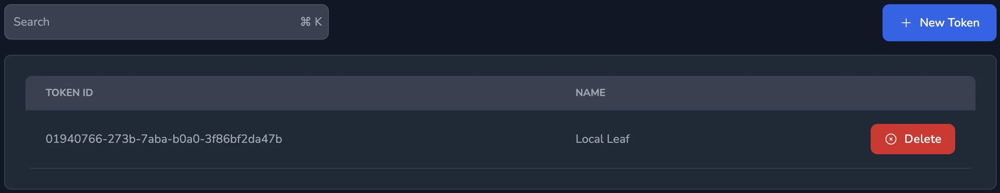

Restricted Leaf Servers are connected to the Origin Server using a personal API token. In this mode the Leaf Server is treated as untrusted and is limited in the functionality it can perform. Restricted Leaf Servers are useful when a user needs to run spaces on their Local Machine using Docker or Podman, but still needs to pull configuration templates from the Origin Server.

The Origin Server needs to be configured with `enable_leaf_api_tokens` set to true.

## Generating an API Token

Login to the Origin Server and generate an API token on the `API Tokens` page by clicking `New Token`, entering a name and then clicking `Create Token`.



## Configuration

A stub configuration file can be generated using the `knot scaffold --server` command:

```yaml {filename=knot.yaml}
# Server configuration
server:
  # Address and port to listen on
  listen: http://127.0.0.1:3000

  # Address and port to listen on for agents
  listen_agent: 0.0.0.0:3010

  # Address and port for the agents to connect to
  agent_endpoint: "srv+knot-server-agent.service.consul"

  # The wildcard domain to expose the web interface of spaces on
  # wildcard_domain: '*.example.com'

  # Disable Proxy functionality
  disable_proxy: false

  terminal:
    webgl: true

  # Encryption key for protected variables
  # encrypt: VF9hmdXZyzNF3rcP6M0P

  # Optional server location, defaults to the hostname
  # location: myservers

  # Shared secret when using leaf servers with an origin server
  # shared_token: secret

  # Enables leaf servers to work in a restricted mode using API tokens
  # enable_leaf_api_tokens: true

  # The address of the origin server, when given along with shared_token the server will be configured as a leaf server
  # origin_server: https://knot-origin.ecample.com:3000

  # MySQL storage
  mysql:
    enabled: false
    # MySQL host if prefixed with srv+ then SRV+ lookup will be performed
    host: localhost
    port: 3306
    user: root
    password: ""
    database: knot

  # BadgerDB storage
  badgerdb:
    enabled: false
    path: ./badgerdb/

  # Redis storage
  redis:
    enabled: false
    # Redis host if prefixed with srv+ then SRV+ lookup will be performed
    hosts:
      - localhost:6379
    password: ""
    db: 0

  nomad:
    addr: http://127.0.0.1:4646
    token: ""

# Optional nameservers to use for SRV lookups
#resolver:
#  consul:
#    - 192.168.0.4:8600
#  nameservers:
#    - 192.168.0.2:53

log:
  level: info
```

- `shared_token` - The shared token needs to be set the to the generated API token.
- `origin_server` - The address of the Origin Server.

The file should be saved as `knot.yaml` the server can then be started using `knot server --config knot.yaml`.

## Shared Items

**Volumes**, are not shared between origin servers and restricted servers. However the volume menu is available on restricted servers, any volume defined and used only on a restricted server will only be available on that server.

**Variables**, only global variables are shared from the origin server to the restricted servers and only if they are not marked restricted.

The variable menu is available on restricted servers but will not show any global variables from the origin server. Additional variables can be defined on the restricted servers, however these variables are marked local and only exist within the restricted servers..

## Backups

Restricted Leaf Servers are not backed up as part of the backup of an Origin Server, therefore backups should be performed on the Restricted Leaf Server as required.
