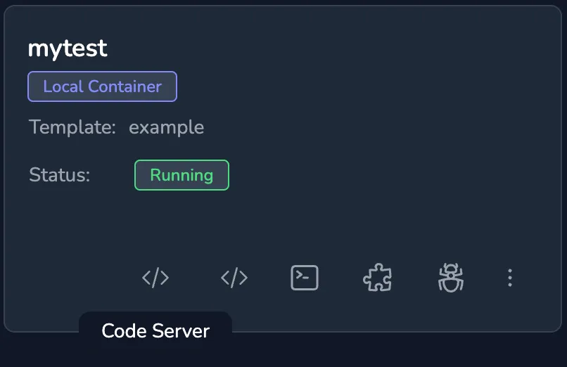
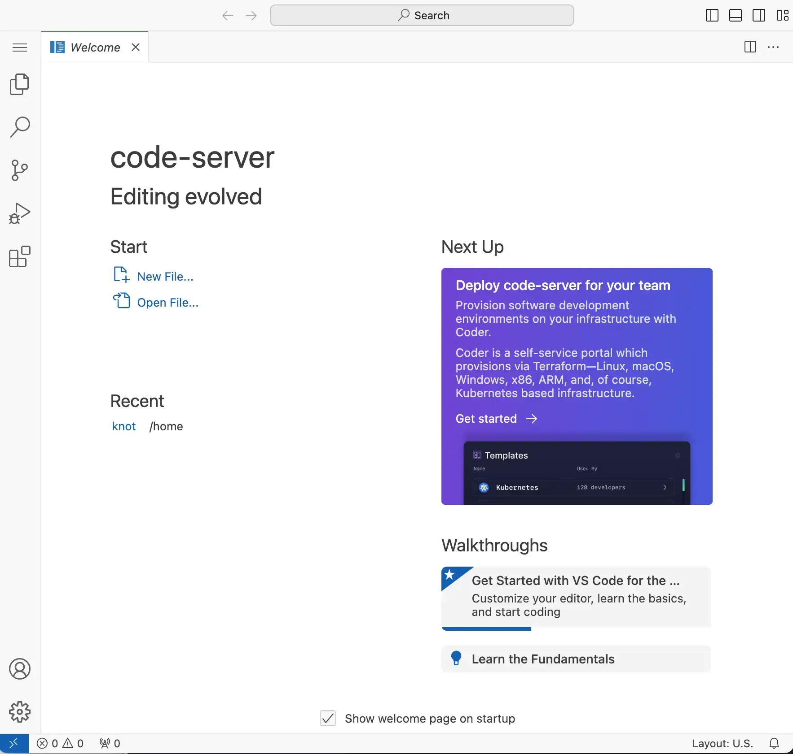

To start the web based Code Server click the `Code Server` icon against the running space, if this icon isn't available then the agent isn't detecting code-server running within the container. When the icon is clicked a new window is opened the the code-server.

Initially code-server is started without any configuration or plugins, however these can all be added as they would be in the desktop version. For more information on code-server please see the [code-server project page](https://github.com/coder/code-server).

Assuming the space template uses a volume for `/home/` then changes to code-server are persistent across restarts.

