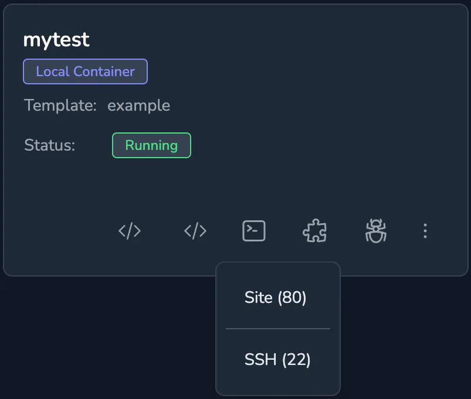

Port forwarding requires the [knot client](/docs/getting-started/client/) be installed on the local computer as it will forward a local port to the port within the remote container.

Clicking the `Ports` icon next to a running space will show the list of ports that are exposed for forwarding, they are shown below the dividing line and can't be clicked.



This example expects to follow on from the [Web Server](../web-server) example where caddy was installed and started on port 80.

On the client machine connect to the knot server, replacing the URL with the address of the real server, first open a terminal and run:

```shell
knot connect https://knot.example.com
```

When the command runs it prompts for the username and password to connect with, the generated access key is stored in `~/.knot.yml`.

Next forward port 9010 on the local host to port 80 on the space called `mytest` by running the command:

```shell
knot forward port 127.0.0.1:9010 mytest 80
```

Point a web browser to `http://127.0.0.1:9010` if everything works correctly the caddy welcome page will open in the browser.


  Ports forwarded in this way require authentication and are not publicly available.

