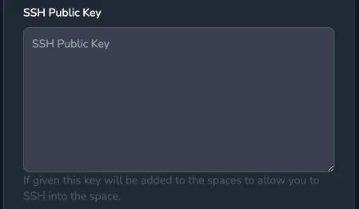

## Adding a Public SSH Key

Click your username in the top right of the web interface and paste your public SSH key into the field `SSH Public Key`, then click `Update User`. This will set the public key to be used by all your containers when connecting via SSH to allow authentication without passwords.



Alternatively the keys can be fetched from GitHub if the username is entered in the `GitHub Username` field.

## Connecting via SSH

SSH access requires the [knot client](/docs/getting-started/client/) be installed on the local computer as it will forward the SSH session to the remote container.

If not already done, on the client machine connect to the knot server, replacing the URL with the address of the real server, first open a terminal and run:

```shell
knot connect https://knot.example.com
```

When the command runs it prompts for the username and password to connect with, the generated acess key is stored in `~/.knot.yml`.

Next open a SSH connection to the space called `mytest` by running the command below (adjust the username as required):

```shell
ssh -o ProxyCommand='knot forward ssh %h' -o StrictHostKeyChecking=no user@mytest
```

The SSH session will be opened to the container and can be used in the same way as any other SSH connection.

## Using .ssh/config

To shorten the command and simplify connecting to the remote space the following can be added to the `.ssh/config` file of the local computer:

```text {filename=".ssh/config"}
Host mytest
  HostName mytest
  StrictHostKeyChecking = no
  LogLevel ERROR
  UserKnownHostsFile=/dev/null
  ProxyCommand knot forward ssh %h
```

Once this is done a SSH connection can be opened with:

```bash
ssh user@mytest
```

The knot client includes a helper function to add entries to the `.ssh/config` file for all spaces owned by the user, this can be done by running:

```shell
knot ssh-config update
```

## Agent Forwarding

Adding the `-A` option to the ssh command will enable agent forwarding which allows SSH keys from the local machine to be used within the space.

The current list of keys exported can be found by running the following on the local machine:

```bash
ssh-add -L
```

SSH keys can be added with `ssh-add YOUR-KEY`

On macOS the ssh-agent will forget the key once it is restarted, e.g. the machine is rebooted, however the key can be added to the keychain with the `--apple-use-keychain` option, `ssh-add --apple-use-keychain YOUR-KEY`.

```shell
ssh-add --apple-use-keychain ~/.ssh/id_rsa
```
