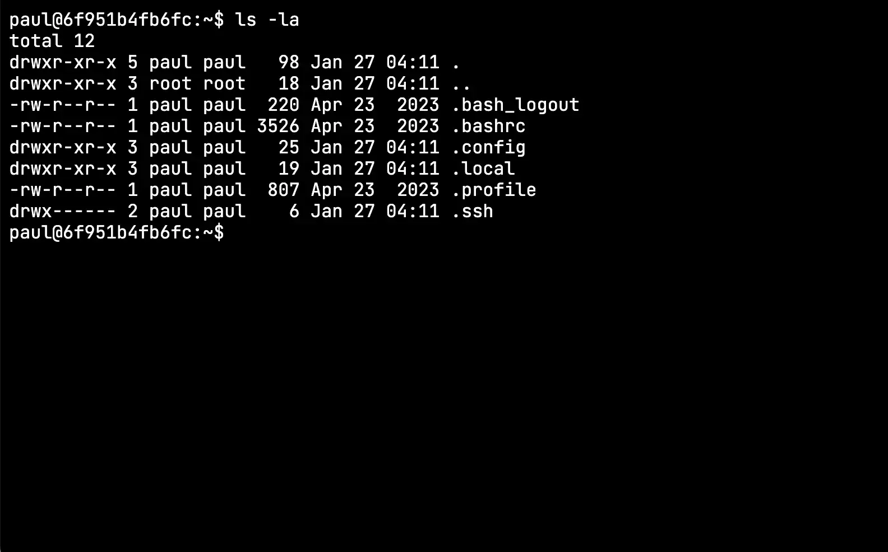



From the `Spaces` page click the `Terminal` icon next on the space to connect to this will open a terminal in a new browser window.

When the terminal opens it will attempt to use the shell specified in the space configuration, however if that shell isn't available within the container then the knot agent will attempt to find an alternative client, the search order is bash, zsh, fish and sh.

Closing the window closes the terminal.
