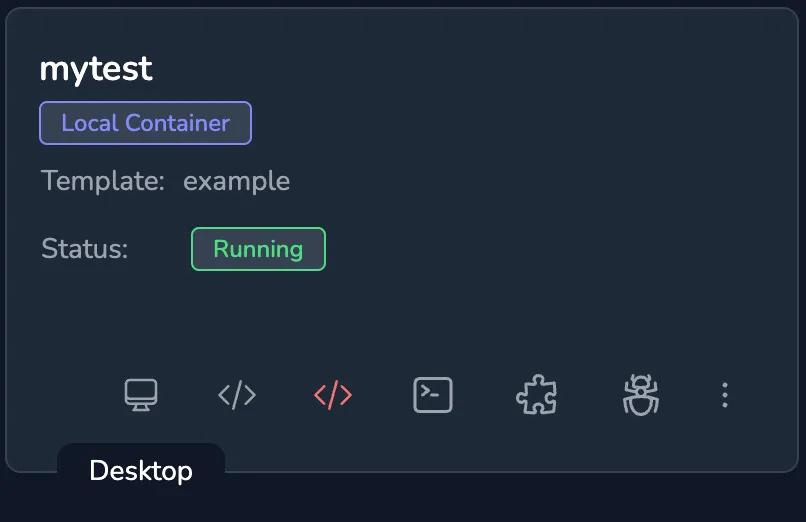
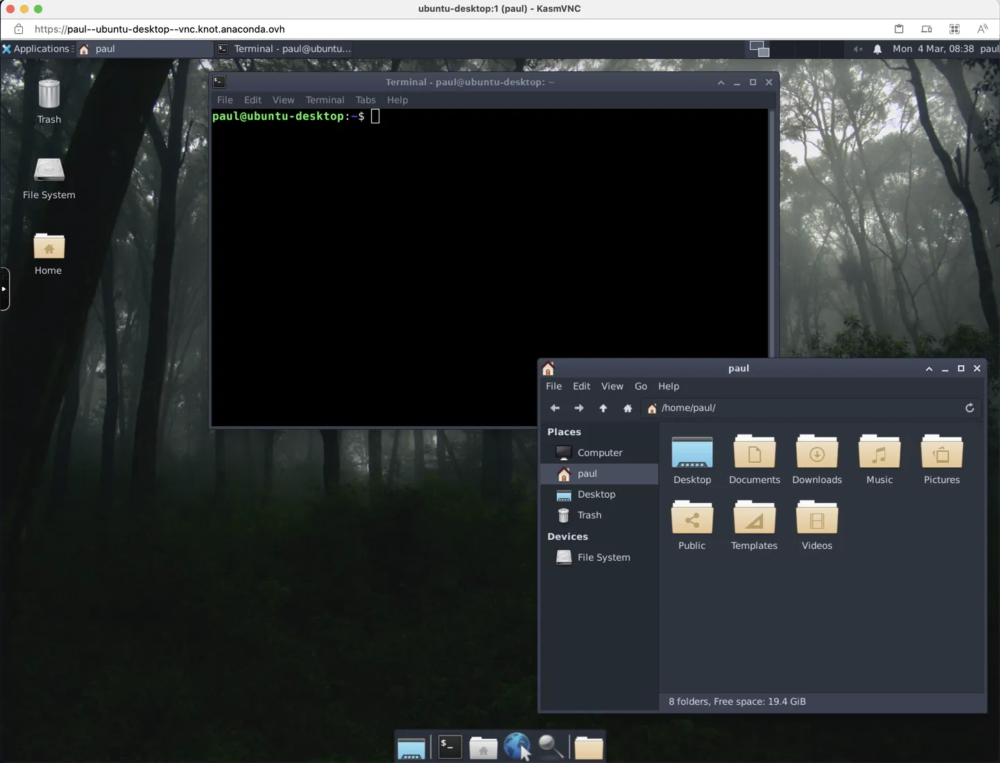

If a space exposes a web based VNC server such as [KasmVNC](https://github.com/kasmtech/KasmVNC) then on the `Spaces` page a `Desktop` button is displayed against the running space.

Clicking the `Desktop` button opens a new browser tab displaying the graphical desktop.

