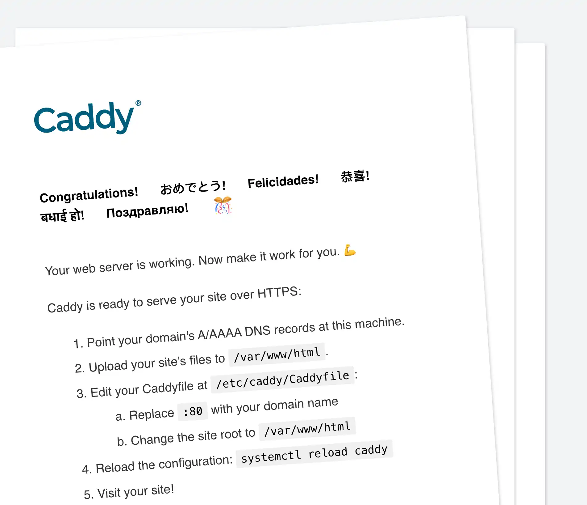

Using a space created from the `mytest` template the first step is to install a web server, for this example [caddy](https://caddyserver.com/) will be used.

Open a web terminal and follow the instructions at https://caddyserver.com/docs/install#debian-ubuntu-raspbian

```bash
sudo apt update -y
sudo apt install -y debian-keyring debian-archive-keyring apt-transport-https curl
curl -1sLf 'https://dl.cloudsmith.io/public/caddy/stable/gpg.key' | sudo gpg --dearmor -o /usr/share/keyrings/caddy-stable-archive-keyring.gpg
curl -1sLf 'https://dl.cloudsmith.io/public/caddy/stable/debian.deb.txt' | sudo tee /etc/apt/sources.list.d/caddy-stable.list
sudo apt update -y
sudo apt install caddy
```

Start caddy with the defaults:

```bash
sudo caddy start --config /etc/caddy/Caddyfile
```

Click the `Ports` icon against the running space and click the port 80, this is the port that is exposed via the web interface of knot.



Once clicked a new tab or window will be opened showing the default welcome page for caddy.



Depending on the template caddy or another web server may already be present or require specific steps to launch the web server.

Where the Ports menu is divided into two groups the top group are clickable and will open in a new tab or window, the bottom group are for use with port forwarding on the command line.


  Ports exposed via the web interface do not require authentication to access them.

