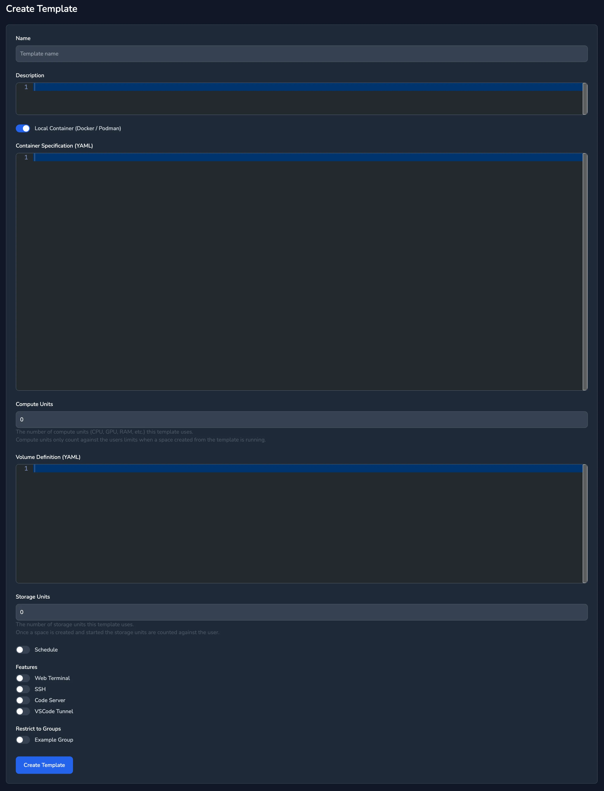

Local spaces can be defined using Docker `Templates`, these templates are used to define the environment that the user will work within and can have an optional volume definition.

When a user creates an instance of the `Template`, a `Space`, and starts it, knot automatically creates any required volumes and launches the job in the local machine.

Local containers work with Docker or Podman running on the same machine as the knot server.

## Container Specification

From the menu select `Templates` then `New Template`, then check the Local Container (Docker / Podman) box:



Example docker / podman template:

```yaml
container_name: ${{ .user.username }}-${{ .space.name }}
hostname: "${{ .space.name }}"
image: ${{.var.registry_url}}/knot-ubuntu:24.04
auth:
  username: "${{.var.registry_user}}"
  password: "${{.var.registry_pass}}"
ports:
  - 8080:80/tcp
volumes:
  - /home/example:/myhome
  - volume1:/volume1

#cap_add:
#  - CAP_AUDIT_WRITE

#cap_drop:
#  - CAP_MKNOD

#devices:
#  - "/dev/ttyUSB0:/dev/ttyUSB0"

#command: [
#  "./knot",
#  "server"
#]

privileged: true
#network: host # or none

environment:
  - "TZ=${{.user.timezone}}"
  - "KNOT_LOGLEVEL=debug"
  - "KNOT_SERVER=${{.server.url}}"
  - "KNOT_AGENT_ENDPOINT=${{.server.agent_endpoint}}"
  - "KNOT_SPACEID=${{.space.id}}"
  - "KNOT_SSH_PORT=22"
  - "KNOT_HTTP_PORT=80=Site"
  - "KNOT_SERVICE_PASSWORD=${{.user.service_password}}"
  - "KNOT_VNC_HTTP_PORT=5680"
  - "KNOT_CODE_SERVER_PORT=49374"
  - "KNOT_VSCODE_TUNNEL=vscodetunnel"
```

The ports section is not required if the ports will only be accessed via knot, it is only required if the ports are to be accessed directly.

## Volumes

Example volume definition:

```yaml
volumes:
  volume1:
```
