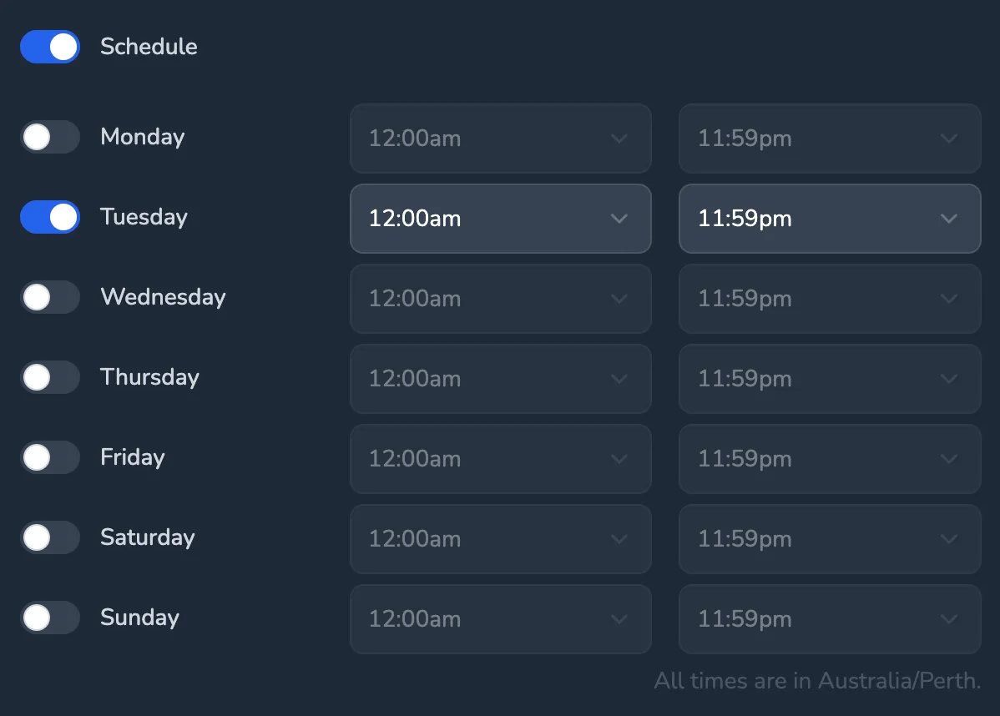
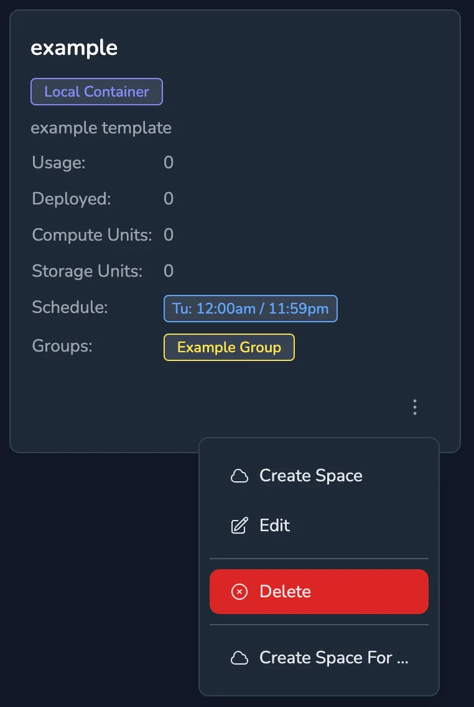

## Creating a Template

To create a new template, navigate to the `Templates` menu and select `New Template`. The following form will be presented:

The `Name` is the name of the template, this is used to identify the template in the system.

The `Description` is a description of the template, this is used to describe the template in the system.

If `Manually Created Space` is checked then the template will expect the user to create the space manually. When this is done the agent will need to be run on the container or VM that is assigned to the space and use the space ID and token to connect to the space.

`Local Container` can be checked if the template is to describe a space that will run on the same server as the knot server via Docker or Podman, otherwise the template will describe a Nomad based space.

`Nomad Job` is the Nomad job specification that describes the space, this is a JSON formatted string that is used to create the space.

`Container Specification` is the Docker or Podman container specification that describes the space, this is a JSON formatted string that is used to create the space.

`Compute Units` is the number of compute units that the space will use, this is used to calculate the cost of running the space. If set to 0 then there's no cost applied.

`Volumes` is the list of volumes that are to be created when the space is started, the volumes are created using the storage systems provided by CSI plugins for Nomad based spaces and the storage system provided by Docker or Podman for Docker / Podman based spaces.

`Storage Units` is the number of storage units that the space will use, this is used to calculate the cost of creating the space. If set to 0 then there's no cost applied.

`Schedule` if this is set then the days and times that the space is allowed to run can be defined. Running spaces are automatically stopped when they are outside of the schedule.

`Features` is the list of features that will be available to the space e.g. Visual Studio Code Tunnels.

`Groups` is the list of groups that the template will be available to, only users that are members of the groups that are assigned to the template will be able to see the template and create spaces from it.

## Deleting a Template

Select the menu item for the template to delete, click `Delete` and confirm the action.

If a template is in use then it can't be deleted.

## Editing a Template

Editing a template is similar to creating a new template. To edit a template select the `Edit` option from the template menu.
