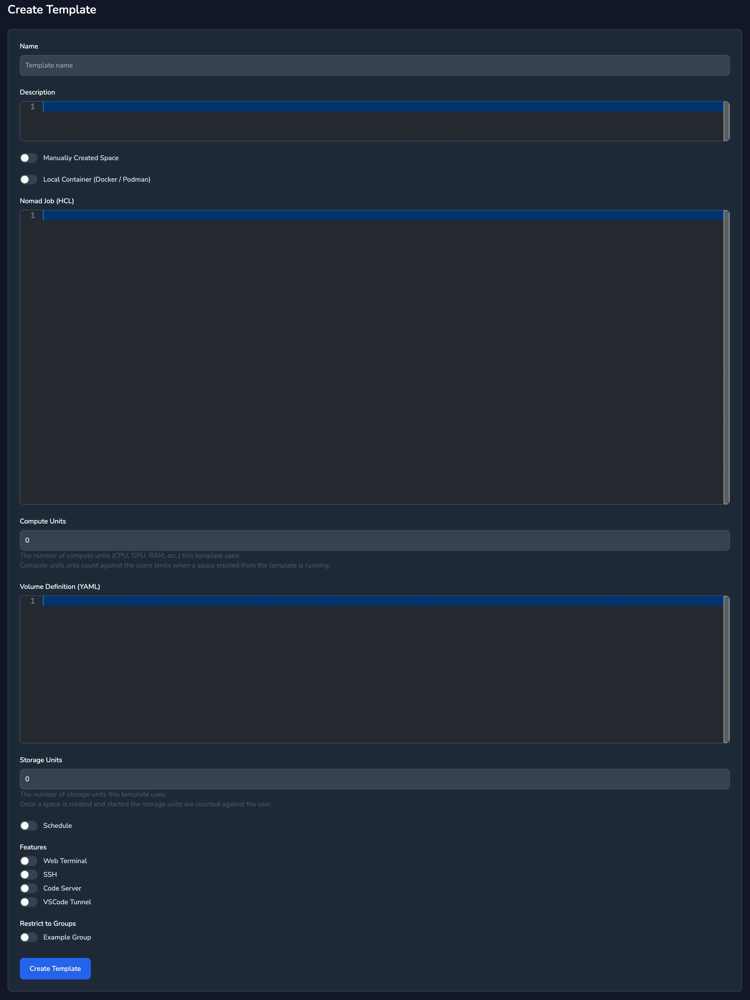

Each environment or `Template`, is defined by a Nomad job and optional volume definition.

When a developer creates an instance of the `Template`, a space, and starts it, knot automatically creates any required volumes and launches the job within the Nomad cluster.

For additional isolation between developers the namespace can be set within the job specification, e.g. `namespace="${{ .user.username }}"`, if this is done then jobs for each developer are placed within their own namespaces.

## Nomad Job

From the menu select `Templates` then `New Template`, the following form is displayed:



The `Name` and `Nomad Job` fields are required, the `Nomad Job` field takes an HCL job specification, see [example environments](/docs/examples-environments/).


  When a change is made to a template all running spaces are marked as an update available, however the spaces are not automatically restarted. Once the spaces are restarted they will receive the updated template.


Template variables can be used to hold registry login information e.g.

```hcl
image = "paularlott/knot-debian:12"
auth {
  username = "${{ .var.registry_user }}"
  password = "${{ .var.registry_pass }}"
}
```


  Variables are plain text within the Nomad template and can therefore be viewed via the Nomad web interface, and alternative solution such at Vault may be more applicable depending on the environment.


### Example Nomad Job

```hcl {filename=Nomad-Job}
job "${{.space.name}}-${{.user.username}}" {
  datacenters = ["dc1"]

  update {
    max_parallel     = 1
    min_healthy_time = "30s"
    healthy_deadline = "1m"
    auto_revert      = true
  }

  group "ubuntu" {
    count = 1

    network {
      port "knot_port" {
        to = 3000
      }
    }

    volume "home_volume" {
      type            = "csi"
      source          = "ubuntu_${{.space.id}}_home"
      read_only       = false
      attachment_mode = "file-system"
      access_mode     = "single-node-writer"
    }

    volume "data_volume" {
      type            = "csi"
      source          = "ubuntu_${{.space.id}}_data"
      read_only       = false
      attachment_mode = "file-system"
      access_mode     = "single-node-writer"
    }

    task "ubuntu" {
      driver = "docker"
      config {
        image = "paularlott/knot-ubuntu:24.04"

        ports = ["knot_port"]

        hostname = "${{ .space.name }}"
      }

      env {
        # Define environment variables for agent
        KNOT_SERVER           = "${{.server.url}}"
        KNOT_AGENT_ENDPOINT   = "${{.server.agent_endpoint}}"
        KNOT_SPACEID          = "${{.space.id}}"
        KNOT_SSH_PORT         = "22"
        KNOT_CODE_SERVER_PORT = "49374"
        KNOT_USER             = "${{.user.username}}"

        TZ = "${{ .user.timezone }}"
      }

      volume_mount {
        volume      = "home_volume"
        destination = "/home"
      }

      volume_mount {
        volume      = "dada_volume"
        destination = "/data"
      }

      resources {
        cores  = 4
        memory = 4096
      }

      # Publish Agent Port
      service {
        name = "knot-${{.space.id}}"
        port = "knot_port"

        check {
          name            = "alive"
          type            = "http"
          protocol        = "https"
          tls_skip_verify = true
          path            = "/ping"
          interval        = "10s"
          timeout         = "2s"
        }
      }
    }
  }
}
```

## Volumes

Each template can define one or more volumes, if volumes are defined then they are created when the environment is deployed and destroyed when the environment is destroyed, starting and stopping the space will have no effect on the volumes.


  Deleting the space will destroy the volumes and all data on them.


An example volume definition that allocates block storage for two volumes `home` and `data` would look like:

```yaml
volumes:
  - id: "ubuntu_${{.space.id}}_home"
    name: "ubuntu_${{.space.id}}_home"
    plugin_id: "hostpath"
    capacity_min: 1G
    capacity_max: 10G
    mount_options:
      fs_type: "ext4"
      mount_flags:
        - rw
        - noatime
    capabilities:
      - access_mode: "single-node-writer"
        attachment_mode: "file-system"

  - id: "ubuntu_${{.space.id}}_data"
    name: "ubuntu_${{.space.id}}_data"
    plugin_id: "hostpath"
    capacity_min: 1G
    capacity_max: 10G
    mount_options:
      fs_type: "ext4"
      mount_flags:
        - rw
        - noatime
    capabilities:
      - access_mode: "single-node-writer"
        attachment_mode: "file-system"
```

In the example the ID of the volume is given as `ubuntu_${{.space.id}}_home`, `.space.id` is replaced with the unique ID of the space using the volume.

If volume definitions are added or removed from the space template then those volumes are created or destroyed the next time the space is started. Any data in a volume being deleted will be lost.
