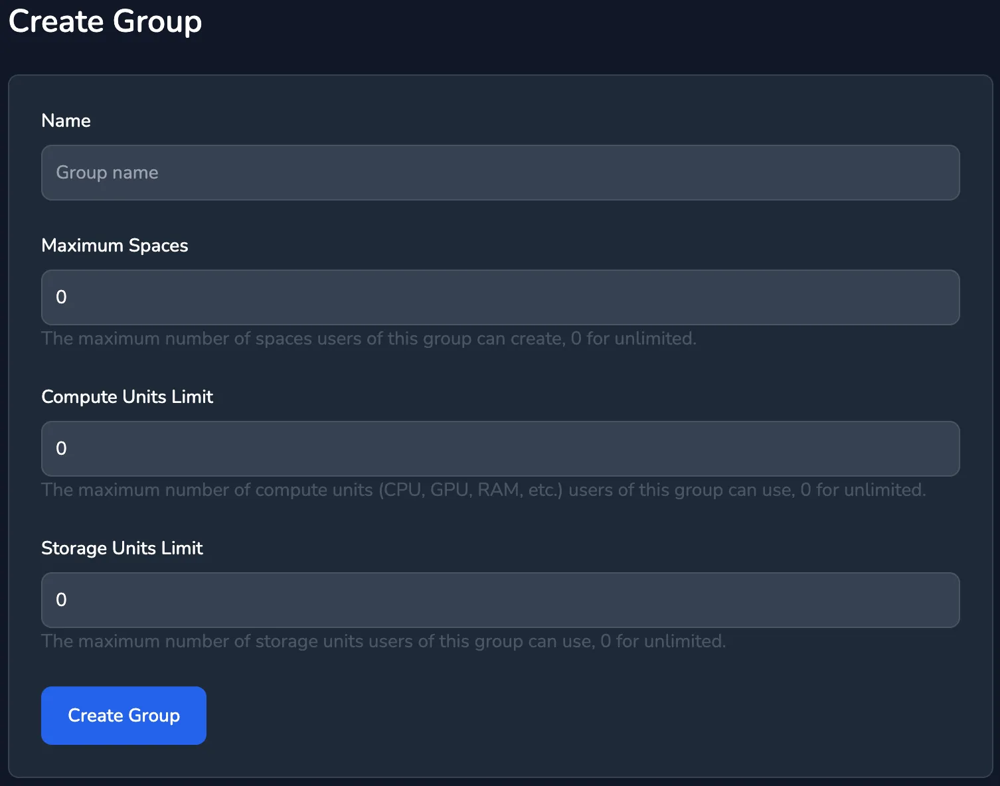
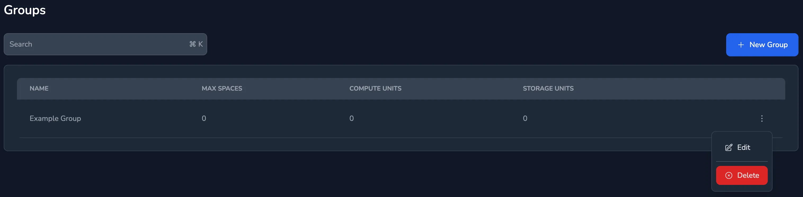

knot allows groups to be defined, groups can be used to limit which templates each user can see. For example web developers may need PHP environments but have no need for a Go development environment used by DevOps.

Groups can also be used to set the limits for Compute and Storage Units that a user can use. When a user is a member of multiple groups the limits are combined.

## Creating Groups

From the menu select `Groups` and then `New Group`, the following form will be presented:

The `Name` is the name of the group, this is used to identify the group in the system.

If `Maximum Spaces` is set to a number other than 0 then it is used as a limit to the number of spaces that a user can create when they are a member of this group.

If `Compute Units Limit` is set to a number other than 0 then it is used as a limit to the number of compute units that a user can use when they are a member of this group.

If `Storage Units Limit` is set to a number other than 0 then it is used as a limit to the number of storage units that a user can use when they are a member of this group.

## Deleting a Group

Select the menu item for the group to delete, click `Delete` and confirm the action.

## Editing a Group

Editing a group is similar to creating a new group. To edit a group select the `Edit` option from the group menu.
