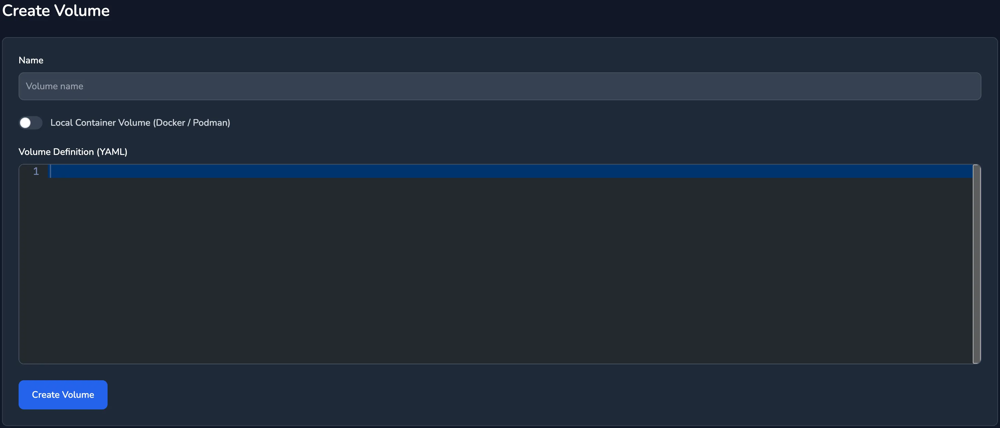
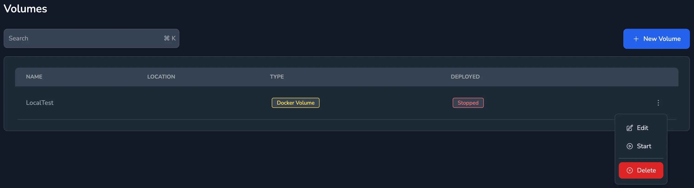
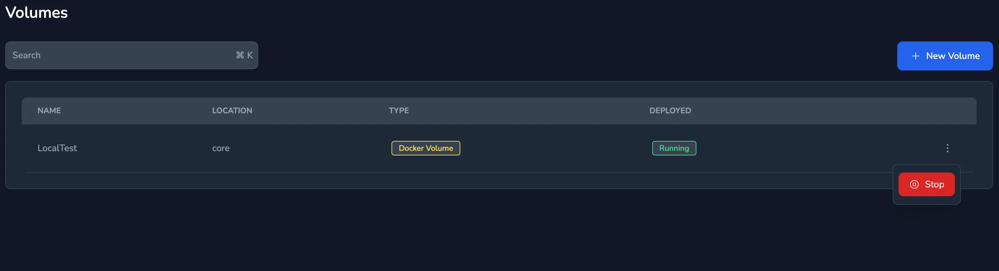

Standalone volumes can be created and managed independently of spaces. This flexibility allows for a volume to be created and then attached to multiple spaces, such as providing storage for `/home`.

These standalone volumes are not impacted by the lifespan of the spaces they're attached to. Even if all spaces are deleted, these standalone volumes, along with their data, will continue to persist.

For Nomad volumes any Container Storage Interface (CSI) driver supported by Nomad can be used, knot places no additional requirements on this.

Standalone volumes do not get counted within the users Storage Units quota.

## Creating a Volume

### Nomad CSI Volume

From the menu select `Volumes` then click `New Volume` the following form will be presented:



The `Name` field is a descriptive name for the volume, it's not used within the volume definition. The Volume Definition field takes YAML and expects a single volume to be defined. If more than one volume is defined then the volume will not be able to be started.

The following defines a volume named `test_home`:

```yaml
volumes:
  - id: "test_home"
    name: "test_home"
    plugin_id: "hostpath"
    capacity_min: 10G
    capacity_max: 10G
    mount_options:
      fs_type: "ext4"
      mount_flags:
        - rw
        - noatime
    capabilities:
      - access_mode: "single-node-writer"
        attachment_mode: "file-system"
```

The description of the values can be found in the Nomad [Volume Specification](https://developer.hashicorp.com/nomad/docs/other-specifications/volume).

Once the name and definition have been entered click `Create Volume` to define the volume.

### Docker / Podman Volume

From the menu select `Volumes` then click `New Volume`, check the `Local Container Volume` option, this can't be changed later.


Then define the volume:

```yaml
volumes:
  test_home:
```

## Starting a Volume

Only once a volume has been started will it be available within the cluster.

From the `Volumes` page click the menu next to the volume to start and select `Start`.



## Stopping a Volume


  Stopping a volume will destroy all data on the volume.


Stopping a volume will free the resources that it is using, this will destroy all data on the volume.



## Deleting a Volume

Only stopped volumes can be deleted, from the dropdown menu next to the volume select `Delete` and confirm the choice.
