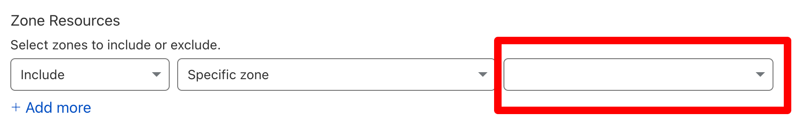
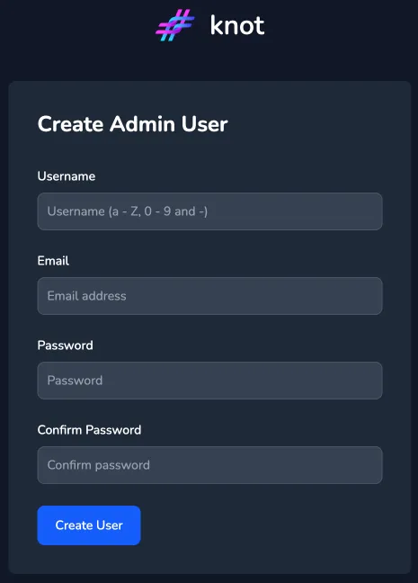
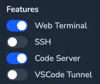
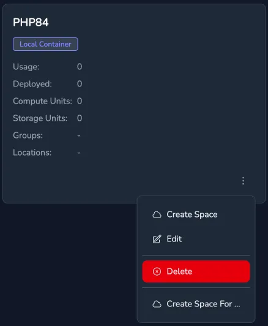
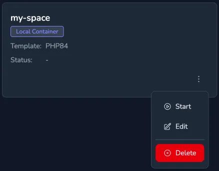
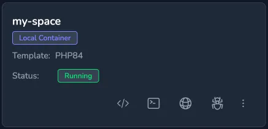

If you've been looking for a way to build a cloud-based development environment with proper SSL support for your local network, then you're in the right place. Combining Knot, the Caddy web server and Cloudflare makes this not only possible but quite seamless. Here’s a step-by-step guide to get you started.

## What You’ll Need

To follow this guide, make sure you have the following ready to go:
- A Cloudflare account (other similar providers might work, but we'll stick to Cloudflare here).
- A registered domain name set up with Cloudflare's name servers.
- A machine equipped with Docker and Docker Compose.
- The IP address of the aforementioned machine.

With these essentials lined up, we can roll up our sleeves and get started.

## Configuring Cloudflare

### 1. Creating an API Key
Caddy needs the ability to create DNS records for your domain to handle SSL certificates. This requires a Cloudflare API key. Here’s how to set that up:
1. Log in to your Cloudflare dashboard.
2. Navigate to **My Profile** > **API Tokens**.
3. Click **Create Token** and select the preset template for "Edit Zone DNS."
4. Under **Zone Resources**, select the domain you'll use for this project.
5. Click **Continue to Summary** > **Create Token**.
6. Copy the API token and save it—don’t lose this, you’ll need it later.



### 2. Adding DNS Records
Your web interface, along with any spaces, will be served via subdomains. To configure this, go to your Cloudflare dashboard, select your domain, and add the following **A records** pointing to your machine’s IP. Make sure these records are not proxied.

| **Name**                      | **Type** | **Value**  | **Description**                |
|-------------------------------|----------|------------|--------------------------------|
| knot.\<yourdomain>.com        | A        | \<host ip> | Main web interface             |
| *.knot.\<yourdomain>.com      | A        | \<host ip> | Spaces' web interface          |
| *.tunnel.\<yourdomain>.com    | A        | \<host ip> | Tunnel web interface           |

Done? Great. Now we’re ready to move to server-side setup.

## Configuring Your Server

You'll need access to the terminal of the machine you’ll use as your development server. Here's how to set up the environment.

### 1. Setting Up a Project Directory
First, create a folder to store everything related to your configuration and data:

```
mkdir knot
cd knot
```

### 2. Required Files
Inside the `knot` directory, create the following files with these exact contents (make adjustments where specified):

#### a) **.env** - Environment Variables
This file will hold necessary environment configurations. Replace placeholders like `<your key>`, `<your domain>`, and `<host ip>` with your actual values.

```
CLOUDFLARE_KEY=<your key>
DOMAIN=knot.<your domain>
TUNNELDOMAIN=tunnel.<your domain>
IP=<host ip>

KNOT_ENABLE_TOTP=false

KNOT_LISTEN_AGENT=0.0.0.0:3001
KNOT_AGENT_ENDPOINT=${IP}:3001
KNOT_LISTEN_TUNNEL=0.0.0.0:3010
KNOT_URL=https://${DOMAIN}
KNOT_WILDCARD_DOMAIN=*.${DOMAIN}
KNOT_TUNNEL_DOMAIN=${TUNNELDOMAIN}
KNOT_BADGERDB_ENABLED=true
KNOT_BADGERDB_PATH=/database
```

NOTE: If you are installing this on an internet connected machine with a public IP address then please change KNOT_ENABLE_TOTP=false to KNOT_ENABLE_TOTP=true. Also ensure that none of the ports are directly accessible from the internet.

#### b) **docker-compose.yml** - Docker Compose Configuration

This file defines the services, their environment variables, and the networks they'll use:

```
services:
  caddy:
    image: paularlott/knot-caddy
    env_file:
      - env
    ports:
      - "80:80"
      - "443:443"
    networks:
      - caddy_network
    volumes:
      - ./caddy-data:/data
      - ./Caddyfile:/etc/caddy/Caddyfile

  knot:
    image: paularlott/knot
    hostname: knot1
    env_file:
      - env
    ports:
      - "3001:3001"
    networks:
      - caddy_network
    volumes:
      - /var/run/docker.sock:/var/run/docker.sock
      - ./database:/database
    user: root:root

networks:
  caddy_network:
```

#### c) **Caddyfile** - Caddy Configuration
This file handles certificates and proxies requests between the front end and your services. Use the following template:

```
{
  admin 127.0.0.1:2019
  storage file_system {
    root /data
  }
}

{$DOMAIN} {$KNOT_WILDCARD_DOMAIN} {
  tls {
    dns cloudflare {$CLOUDFLARE_KEY}
    resolvers 1.1.1.1
  }

  log {
    output stdout
    level INFO
    format transform "{common_log}"
  }

  encode zstd gzip

  reverse_proxy knot:3000 {
    transport http {
      tls
      tls_insecure_skip_verify
    }
  }
}

*.{$TUNNELDOMAIN} {
  tls {
    dns cloudflare {$CLOUDFLARE_KEY}
    resolvers 1.1.1.1
  }

  log {
    output stdout
    level DEBUG
    format transform "{common_log}"
  }

  encode zstd gzip

  reverse_proxy knot:3010 {
    transport http {
      tls
      tls_insecure_skip_verify
    }
  }
}
```

### 3. Starting the Environment
With everything in place, it’s time to fire things up.

Run this command from inside the project directory to start the services in the background:

```
docker-compose up -d
```

Access the web interface at `https://knot.<your domain>`. If everything works as expected, you should see the setup screen for Knot!

## Installing Knot

Follow the prompts on the Knot setup screen to complete the installation. Once the setup is done, you'll arrive at the login page.



## Creating a Template

Before creating individual spaces, you’ll set up a template. Templates define the environments your spaces will use.

1. Log in and go to the **Templates** section in the sidebar.
2. Click **Create Template** and name it something like `PHP84`.
3. Select the **Local Container** option.

For **Container Specification**, paste the following YAML:

```
container_name: ${{ .user.username }}-${{ .space.name }}
hostname: "${{ .space.name }}"
image: paularlott/knot-php:8.4
volumes:
  - ${{ .user.username }}-home:/home

cap_add:
  - CAP_AUDIT_WRITE

environment:
  - "TZ=${{.user.timezone}}"
  - "KNOT_SERVER=${{.server.url}}"
  - "KNOT_AGENT_ENDPOINT=${{.server.agent_endpoint}}"
  - "KNOT_SPACEID=${{.space.id}}"
  - "KNOT_HTTP_PORT=80=Site"
  - "KNOT_SERVICE_PASSWORD=${{.user.service_password}}"
```

For **Volume Specification**, use:

```
volumes:
  ${{ .user.username }}-home:
```

Select **Web Terminal** and **Code Server** under "Features" and save your template.



## Creating and Starting a Space



1. Navigate to the **Spaces** section and create a space from the PHP84 template. Name it something like `my-space`.
2. Start the space using the menu option `Start Space`.



Once the space is running, you'll see options to access its features:
- **Code Server** opens a web-based code editor.
- **Web Terminal** provides terminal access within the container.
- **Site** shows the web application running inside.
- **Logs** gives you real-time logs.



To add content to your space’s web interface, simply use the **Web Terminal** to upload files into the `public_html` folder.

When you’re done using a space, you can stop it. Don’t worry—data on persistent volumes will still be there when you restart.

## Setting Up Tunnels

TTunnels allow you to make services running inside your spaces or your laptop accessible via a URL. They can be used to expose the services on the local LAN or allow access from anywhere on the internet. They function as a bridge, rerouting traffic through your server to the desired service.

Tunnels are only active while the client is running, therefore you can create and destroy tunnels as required.

If you deployed your environment into a LAN environment then the tunnels will only be available within the LAN.

### Starting a Tunnel

1. Open the **Web Terminal** for the space you want to expose.
2. Run the following commands to log in to the Knot server and start a tunnel:

```
knot-agent connect https://knot.<your domain>
knot-agent tunnel http 80 tunnel1
```

   Here’s what’s happening:

   - `http` specifies the protocol used by the tunnel.
   - `80` refers to the internal service port mapped during space creation.
   - `tunnel1` is the name of the tunnel—it can be anything you like.

The tunnel will be publicly accessible at the following URL (replace placeholders with actual values):
`https://<username>--tunnel1.tunnel.<yourdomain>.com`

### Managing Tunnels

From the Knot web interface, click the **Tunnels** link in the sidebar to view active tunnels. This dashboard gives you a quick overview of which services are exposed and their corresponding addresses.

To stop a tunnel that's no longer needed, simply return to the Web Terminal and press **Ctrl+C**.

### Advanced Tunnel Use

Tunnels aren’t just one-way streets. You can also use the Knot client on your local machine to create reverse tunnels. This allows you to expose services from your personal device to a Knot-managed space, making it easier to test applications or access local resources remotely.

## Enabling SSH for Your Spaces

SSH access is essential if you want secure, powerful, and flexible control over your spaces. Not only does it unlock full terminal access, but it also allows you to use tools like Git, SCP, and more.

### Getting Started with SSH

#### Enabling SSH in the Template

For SSH access, you’ll need to tweak the template used by your space. Here’s how to enable SSH:

1. Go to the **Templates** tab on the Knot web interface.
2. Locate the template for your space and click **Edit**.
3. Select the **Enable SSH** checkbox and save your changes.

Now restart your space from the **Spaces** section to apply the changes.

#### Installing the Knot Client

If you’ve not installed the Knot client on your local machine, now’s the time. Instructions for installation can be found on the [Client Install Page](/docs/getting-started/client/) of getknot.dev. Follow the guide according to your operating system to set it up.

#### Adding an SSH Key

To connect via SSH, you’ll need to add your public key to your Knot profile. Here are two simple ways to do this:

- **Using an existing public key:** If you’ve already set up SSH keys (e.g., `id_ed25519` or `id_rsa`), head to the **Profile** section on the Knot web interface. Paste the contents of your public key into the **SSH Public Key** field and hit **Save**.

- **Using GitHub keys:** If your public keys are linked to your GitHub account, simply enter your GitHub username in the designated field. Knot will automatically fetch your keys.

### Connecting to Your Space

Once your SSH key is added, you’re ready to connect via SSH. Follow these steps:

Open a terminal on your local machine and log in to the Knot server, then have knot update your .ssh/config file with all available spaces:

   ```
knot login https://knot.<yourdomain>
knot ssh-config update
   ```

Now, to connect to your space with ssh:

   ```
   ssh <username>@knot.<spacename>
   ```

Replace <username> with your Knot username and <spacename> with the name of your space.

### Unlocking More SSH Features

Once connected, you can take advantage of advanced SSH features like:
- **Port Forwarding:** Redirect network traffic from one port to another securely.
- **SSH Agent Forwarding:** Use your local keys to authenticate operations inside the space.
- **File Transfer:** Use tools like `scp` or `rsync` to transfer files between your space and local machine.

With SSH access, you have complete command-line control of your remote environment, making it a true extension of your local terminal.

## The Bigger Picture

Congratulations! With tunnels and SSH in place, your cloud development environment is now accessible, flexible, and equipped for nearly any development scenario. Here’s a quick recap of why this matters:
- **Remote Accessibility:** Tunnels make your services reachable from anywhere but only when needed e.g. while debugging webhooks.
- **Complete Control:** SSH lets you operate your spaces as if you’re sitting right at the server.

### Ideas for Next Steps

To make your setup even more robust, consider these enhancements:

- **Add a Mesh Network:** Using tools like [Netbird](https://netbird.io/), you can securely connect to your environment from any location without exposing it to the public internet.
- **Deploy a Local DNS Server:** Mask private IP addresses from the public while simplifying network management.
- **Scale with Nomad Clusters:** Expand your setup to a cluster of servers, enabling workloads to shift dynamically across nodes.

While these go beyond the basic setup, they’re worth exploring as you scale your needs. For now, enjoy the power and versatility of your cloud-based dev environment!

Learn more about Knot at [getknot.dev](https://getknot.dev/) or check out the codebase on [GitHub](https://github.com/paularlott/knot).
